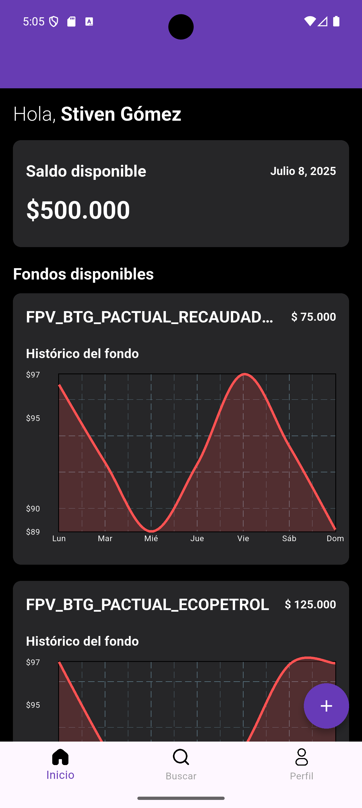
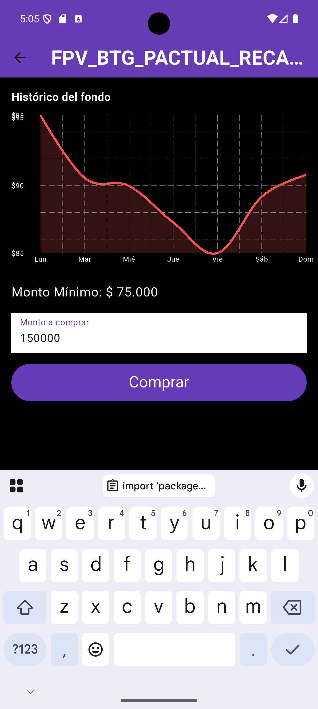
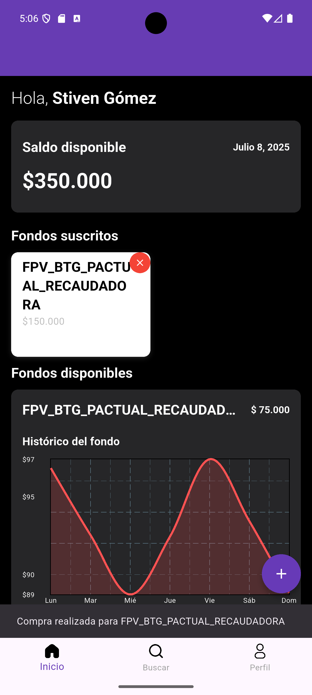
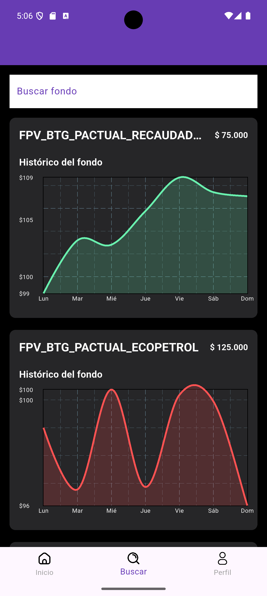
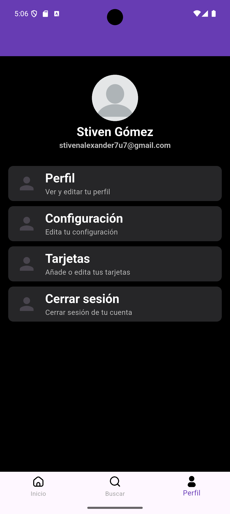
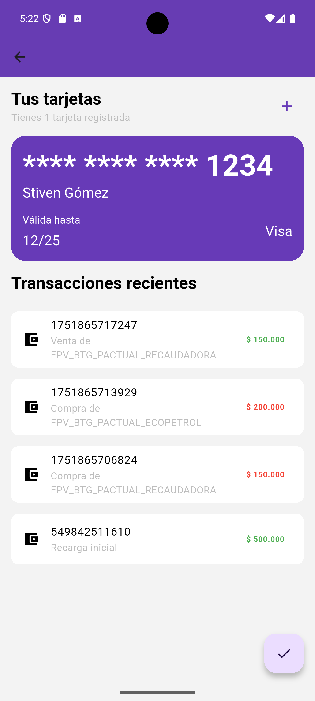

# prueba_tecnica_amaris_flutter

Prueba de Selección en Amaris Consulting.

## Lenguaje y versiones

Este proyecto ha sido creado en Flutter, Dart en su versión 3.32.5

## Imagenes del proyecto

## Pruebas funcionales

El proyecto inicia siempre desde el home, ya tiene una sesión activa mockeada y esta información también está incluida en el BLOC.
Las gráficas de los fondos se muestran y son aleatorias, una vez ingresado a un fondo este valida el valor ingresado a comprar, como mínimo, si el valor es correcto y demás, una vez comprado sale una alerta y se actualiza el valor total del balance de la cuenta, añade la transacción realizada a el historial de transacciones, que este se puede visualizar dándole clic en el + de la pantalla home.
Una vez se haya comprado un fondo aparecerá en la pantalla de home, este se envía automáticamente y se puede eliminar este fondo dándole clic en la x roja de la tarjeta del fondo, una vez eliminado saldrá otra alerta de la venta de este fondo y guarda la transacción en el historial de transacciones y añade el valor vendido al balance.
